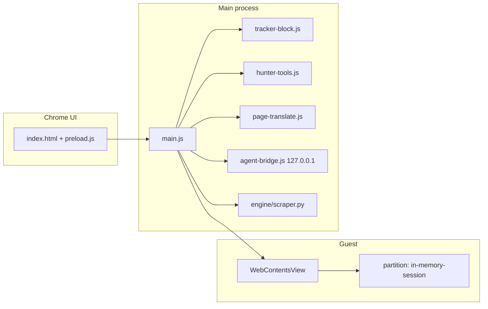

<p align="center">
  
</p>

<h1 align="center">Agent Browser</h1>

<p align="center">
  <strong>A privacy-first Electron browser built for local agents.</strong><br>
  The session lives in RAM. Cookies, form data, and API keys are not written to disk.<br>
  In an emergency, Excommunicado wipes the session and quits.
</p>

<p align="center">
  
  
  
  
</p>

<p align="center">
  <a href="#why-this-exists">Why</a> ·
  <a href="#privacy-model">Privacy</a> ·
  <a href="#features">Features</a> ·
  <a href="#quick-start">Start</a> ·
  <a href="#multi-agent-control-plane">Agent API</a> ·
  <a href="#keyboard-shortcuts">Shortcuts</a> ·
  <a href="#what-this-is-not">Limits</a>
</p>

---

## Why this exists

Most browsers persist a profile: cookies, local storage, history, and extension state land on disk and survive until you remember to wipe them. Privacy-oriented Chromium forks such as [Brave](https://brave.com/privacy-updates/7-ephemeral-storage/) partition third-party storage and delete it when you leave a site or quit. That is a strong default for everyday browsing.

Agent Browser takes a stricter session contract for a different job: **local language models and automation agents driving a real browser**.

- The Chromium session uses the partition name `in-memory-session`. A `persist:` prefix is rejected at startup.
- Guest pages load in an isolated `WebContentsView`. Chrome UI (`index.html` + `preload.js`) never shares that partition.
- Bookmarks, history, the OpenAI key, and the agent bridge token stay in RAM for this process only.
- Closing the window, wiping session data, or running **Excommunicado** (`Ctrl+Shift+E`) ends the session.

The product is a working desktop browser, not a headless SDK. You can search, read, download, and talk to a local model in the same window an agent is using.

---

## What's new in 0.1.1

- **Translate** is a session tool (on by default). Right-click a page, the chrome, or any dropdown menu and pick Turkish, German, English, French, or Spanish. Selection-only translate and **Show original** are included. Nothing is written to disk; the request goes to Google’s public translate endpoint.
- Context menus work while you browse **and** while a chrome menu is open (overflow, Shield, site, tools, shortcuts, profile, downloads). Opening Translate no longer drops you on a stub RAM sheet.
- Local-model chat no longer stays on “agent is replying” forever. Send waits for a reply or a visible error (about 45s). A selected `.gguf` file is not treated as a live chat server. Bind the model in **Settings → Agents**.
- Print from the guest right-click menu. The toolbar **AI** control opens the local-models sidebar. Downloads uses a download-arrow overlay.

---

## Privacy model

| Surface | Where it lives | Survives quit? |
|---|---|---|
| Cookies, site storage, service workers | In-memory Chromium partition | No |
| Bookmarks, session history, omnibox state | Renderer RAM | No |
| Cloud API key, agent bridge token | Process memory | No |
| Shield / Ghost Network / tool toggles | Process memory | No |
| Page text sent through Translate | Process memory; outbound request to Google Translate | No local copy |
| Files saved through Downloads or Media Hunter | Your Downloads folder | **Yes** — a banner warns that Excommunicado may not delete them |
| Obsidian vault path / localhost memory endpoints | Session config in RAM; vault files you already have on disk are untouched | Vault files on disk are yours |

**Defaults (on):** tracker/ad blocking, drop third-party cookies, `DNT: 1`, Chrome identity (User-Agent and Client Hints match this Chromium build, no Electron token), Translate.

**Defaults (off):** Ghost Network, Media Hunter, multi-agent bridge, and the rest of the session tool catalog. They exist for this RAM session only; there are no persistent Chromium extensions.

**Ghost Network** sends all traffic through `socks5://127.0.0.1:1080` (Tor, `ssh -D`, or any local SOCKS5 listener). If nothing is listening, pages will not load. That is intentional.

**Rate-Limit Guard** pauses agent actions when Cloudflare / reCAPTCHA-style waits are detected. It does not solve captchas.

This is not a claim of anonymity, legal immunity, or “untraceable” browsing. It is a **session isolation** design: when the process dies, the browser profile dies with it.

---

## Features

### Browser chrome

- Frameless window, mint-green shield mark with a black **A**
- Tabs, back / forward / reload, address bar (URL or search)
- Session bookmarks and RAM-only history
- Find in page, print (including guest right-click), downloads overlay
- Settings, Shield menu, site info, Ghost Network toggle
- Toolbar **AI** button for the local-models sidebar
- English UI throughout

Address-bar search uses the engine you pick in Settings (DuckDuckGo by default; Startpage, Google, Bing, and others are in the picker).

### Shield

Network requests are filtered in the main process (`tracker-block.js`) when Shield is armed:

- Known analytics, ad, and affiliate **hosts** (Google, Meta, Amazon, Taboola, Outbrain, adult ad networks, and others listed in code)
- First-party **ad paths** on publisher domains (`/pagead`, `/aclk`, Facebook `/tr`, Amazon `/sspa`, and similar)
- Cosmetic hide CSS for leftover ad slots

Publisher pages themselves (YouTube watch, Amazon product pages, Google Search, Facebook profiles, video CDNs such as `phncdn`) are meant to keep working. The fixture in `test-tracker-block.js` encodes that split.

### Local models and AI sidebar

Model, session API key, and Brain (Off / SiYuan / Obsidian) live in **Settings → Agents**. The sidebar is chat only.

The sidebar scans known roots (Ollama, LM Studio, GGUF/GGML files on disk) and can bind:

- A **live** loopback runtime (Ollama, LM Studio, Jan). A weight file on disk is not enough unless that runtime is running and loaded
- **OpenAI** with a session API key (RAM only — never written to disk)

You can ask about the current page or run **Summarize page**. Chat is not persisted. If the runtime is down or a file-only model is selected, the sidebar shows an error instead of hanging.

### Memory Bridge

Optional loopback bridges for this session only:

Mem0, Zep, LangGraph / LangChain Memory, SiYuan, LlamaIndex, Motorhead, MemGPT / Letta, and an **Obsidian** vault folder.

Tokens stay in RAM. Endpoints are expected on `127.0.0.1`.

### Translate

Session tool `page-translate` (`page-translate.js`). When on, the context menu (and Settings / overflow **Translate…**) offers:

Turkish · German · English · French · Spanish

Visible text nodes are replaced in place. **Show original** restores the RAM copy for that tab. Navigation drops the translation. This is not a stored language pack.

### Universal Media Hunter

Optional context-menu download for HTML5 and YouTube. The app looks up `yt-dlp` and `ffmpeg` outside Electron’s stripped `PATH` (`hunter-tools.js`: Hermes venv, WinGet, Scoop, common install dirs). Failed YouTube extractions surface in the downloads list instead of failing silently.

### Local intelligence search

`engine/scraper.py` is a stdout-only Python agent. It queries public SearX-style nodes, emits JSON, and does not call Big Tech search APIs. Requires Python 3 and `pip install -r engine/requirements.txt`. Results paginate in `search.html` (up to 100 pages).

### Session tools

The Extensions page is a **session tool catalog**, not Chrome Web Store. Tools include Shield, Ghost Network, Security V1 (camera-only and screen capture off; microphone can be allowed per site), **Translate**, Cookie cutter, Do Not Track, identity mask, canvas noise, scrape helpers (Markdown DOM, tables, XHR/WebSocket hunter, infinite scroll), multi-tab orchestrator, headless/invisible mode, sandbox isolator, and Excommunicado Lock. Details expand under each card.

The **Extension expert** is a small in-app advisor: it can turn tools on or off from English or Turkish phrases. It will not fire Excommunicado unless you clearly ask for panic / protocol.

---

## Quick start

### Requirements

- **Windows** is the primary desktop target (`Agent Browser.bat`, WinGet/Scoop hunter paths)
- **Node.js 20+** (Electron 37’s engine requirement)
- **npm**
- Optional: **Python 3** + `engine/requirements.txt` for local search
- Optional: **yt-dlp** and **ffmpeg** for Media Hunter
- Optional: a SOCKS5 listener on `127.0.0.1:1080` for Ghost Network

### Install and run

```bash
git clone https://github.com/oguzbayata/agent-browser.git
cd agent-browser
npm install
npm start
```

On Windows you can double-click `Agent Browser.bat` after `npm install`.

Fully quit the app after pulling `main.js` changes. Reloading the renderer is not enough.

### Tests

```bash
npm test
```

Runs `test-tracker-block.js` (shield allow/block fixtures) and `test-hunter-tools.js` (yt-dlp/ffmpeg resolution; may hit the network).

---

## Multi-agent control plane

Enable **Multi-agent bridge** in Settings. The control plane binds **`127.0.0.1` only**. Non-loopback requests are rejected. Auth is a session token (Bearer, `X-Agent-Token`, or `token=` query). Each agent should open its **own tab** and send `X-Agent-Id`.

Catalog (from `agent-bridge.js`):

| Method | Path | Purpose |
|---|---|---|
| `GET` | `/v1` | Catalog |
| `GET` | `/v1/health` | Health |
| `GET` | `/v1/tabs` | List tabs |
| `POST` | `/v1/tabs` | Open a tab (`url`, optional `owner`, `activate`) |
| `GET` | `/v1/tabs/:id` | Tab state |
| `DELETE` | `/v1/tabs/:id` | Close |
| `POST` | `/v1/tabs/:id/activate` | Bring forward |
| `POST` | `/v1/tabs/:id/navigate` | Navigate |
| `POST` | `/v1/tabs/:id/back` | Back |
| `POST` | `/v1/tabs/:id/forward` | Forward |
| `POST` | `/v1/tabs/:id/reload` | Reload |
| `GET` | `/v1/tabs/:id/text` | Visible text |
| `GET` | `/v1/tabs/:id/screenshot` | Screenshot |
| `POST` | `/v1/tabs/:id/evaluate` | Run script in the guest |
| `POST` | `/v1/tabs/:id/click` | Click |
| `POST` | `/v1/tabs/:id/type` | Type |

Example:

```http
POST /v1/tabs HTTP/1.1
Host: 127.0.0.1:<port>
Authorization: Bearer <session-token>
Content-Type: application/json

{"url":"https://duckduckgo.com","owner":"agent-1","activate":true}
```

The Settings panel shows the live loopback URL and token for this process. They are regenerated for the next session.

A second loopback HTTP API (CDP-style helpers: markdown read, screenshot, form fill) logs an `Agent-Key` in the process console. That key is also RAM-only and is cleared by Excommunicado.

---

## Keyboard shortcuts

| Action | Shortcut |
|---|---|
| New tab | `Ctrl+T` |
| New window | `Ctrl+N` |
| New Incognito window | `Ctrl+Shift+N` |
| Downloads | `Ctrl+J` |
| Find in page | `Ctrl+F` |
| Print | `Ctrl+P` |
| Clear session data | `Ctrl+Shift+Del` |
| **Excommunicado** | `Ctrl+Shift+E` |
| Back / Forward | `Alt+←` / `Alt+→` |

On macOS, `Command` replaces `Ctrl` for the Excommunicado accelerator (`CommandOrControl+Shift+E`).

---

## Architecture



| Piece | Role |
|---|---|
| `main.js` | Window, tabs, session, IPC, Shield wiring, Excommunicado |
| `index.html` / `renderer.js` / `style.css` | Chrome |
| `tracker-block.js` | Host suffixes, first-party ad paths, hide CSS |
| `agent-bridge.js` | Loopback control plane |
| `local-intel.js` | Discover local models and agents |
| `page-translate.js` | In-page translate (TR/DE/EN/FR/ES) |
| `hunter-tools.js` | Resolve yt-dlp / ffmpeg |
| `engine/scraper.py` | Local search, JSON on stdout |
| `extensions.js` | Session tool catalog + expert UI |

Guest navigation is http(s) or local pages: `newtab.html`, `search.html`, `downloads.html`, `useful-links.html`, `extensions.html`, `settings.html`, `memory-bridge.html`.

---

## Excommunicado

`Ctrl+Shift+E` (or the panic control in chrome):

1. Disarms shortcuts and stops agents
2. Clears the in-memory session, tokens, and tool state
3. Shows **EXCOMMUNICADO PROTOCOL: PURGED**
4. Force-quits after about 1.5 seconds

Use it when you want the process gone, not a tidy “clear cookies” dialog.

---

## Project layout

```
Agent Browser/
├── main.js                 # Electron main process
├── index.html              # Chrome shell
├── start.js                # npm start → Electron binary
├── Agent Browser.bat       # Windows launcher
├── tracker-block.js
├── agent-bridge.js
├── hunter-tools.js
├── local-intel.js
├── page-translate.js
├── engine/scraper.py
├── assets/agent-browser-logo.svg
├── assets/translate.svg
└── package.json
```

---

## What this is not

- **Not a packaged store installer.** You run it from the repo with `npm start`.
- **Not Tor Browser.** Ghost Network is opt-in and needs your own SOCKS5 listener.
- **Not a captcha solver.** Rate-Limit Guard only pauses agents.
- **Not a guarantee that downloaded files disappear.** Anything written to disk can remain after purge.
- **Not Chrome Web Store.** Session tools reset when the process exits.

---

## License

The source is published so you can read and run it. **No license is granted yet** (all rights reserved) until a `LICENSE` file is added. Do not assume you may copy, modify, or redistribute this code. Dependencies keep their own licenses (Electron, `@distube/ytdl-core`, and the Python packages in `engine/requirements.txt`).

Security reports: see [SECURITY.md](SECURITY.md).

---

<p align="center">
  <sub>in-memory · no persist · Excommunicado on Ctrl+Shift+E</sub>
</p>
